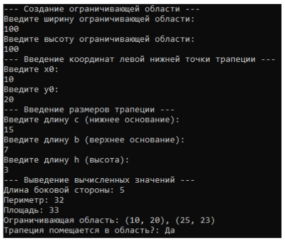
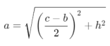
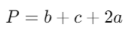
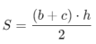

## About The Project

This project contains a simulation model of a regular (isosceles) trapezoid.



### Theory

_A **regular (isosceles) trapezoid** is a convex quadrangle with an axis of symmetry passing through the midpoints of two opposite sides. This quadrilateral is a special case of trapezoids. In any isosceles trapezoid, two opposite sides (bases) are parallel, and the other two sides (sides) have the same lengths. The diagonals also have the same lengths. The angles at each base are equal, and the angles at different bases are adjacent (summing up to 180º)._

A regular trapezoid can be uniquely determined using the following data:
– the length of the upper base **b**;
– the length of the lower base **c**;
– the height of the trapezoid **h**.

The length of the lateral side **a** of a regular trapezoid (_according to the Pythagorean theorem_):



Perimeter **P** of a regular trapezoid:



Area **S** of a regular trapezoid:



The bounding region of a trapezoid is the smallest rectangle that encloses the entire trapezoid. If (x0, y0) are the coordinates of the lower-left corner, then:
* upper left corner (x0, y1) = (x0, y0 + h);
* lower right corner (x1, y0) = (x0 + c, y0);
* upper right corner (x1, y1) = (x0 + c, y0 + h).

### Built With

* [C#](https://learn.microsoft.com/en-us/dotnet/csharp/)


## Getting Started

### Prerequisites

* [Visual Studio](https://visualstudio.microsoft.com/) installed with Net6.0 Support

### Installation

1. Clone the repo
   ```sh
   git clone https://github.com/biggytech/isosceles-trapezoid-model
   ```
2. Open the solution file `isosceles-trapezoid-model.sln`
3. Run the project

## Languages Support

- [x] Russian
